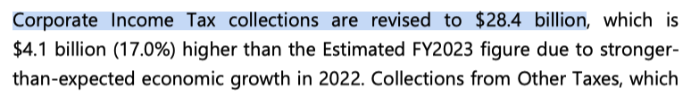
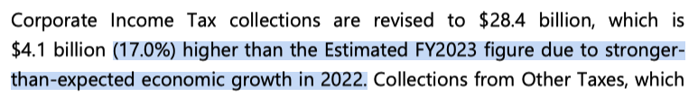
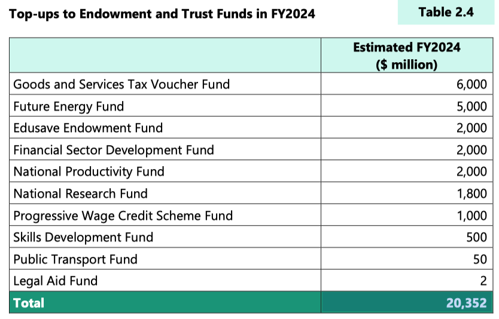
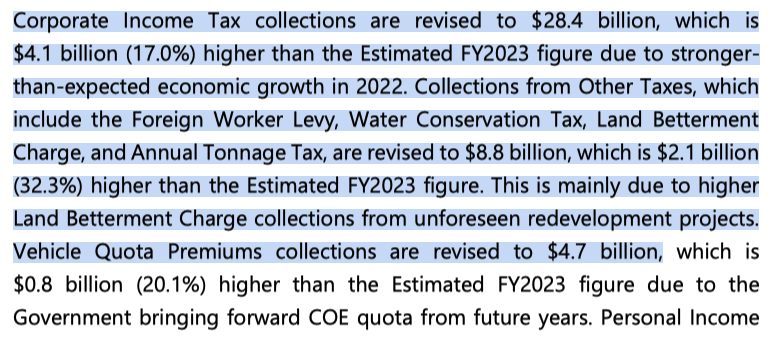
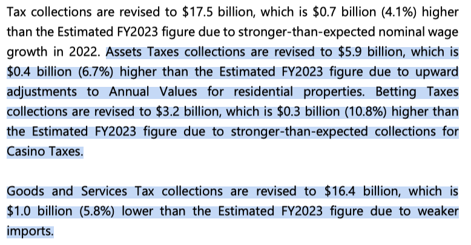
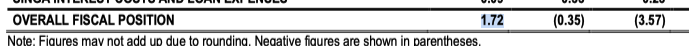
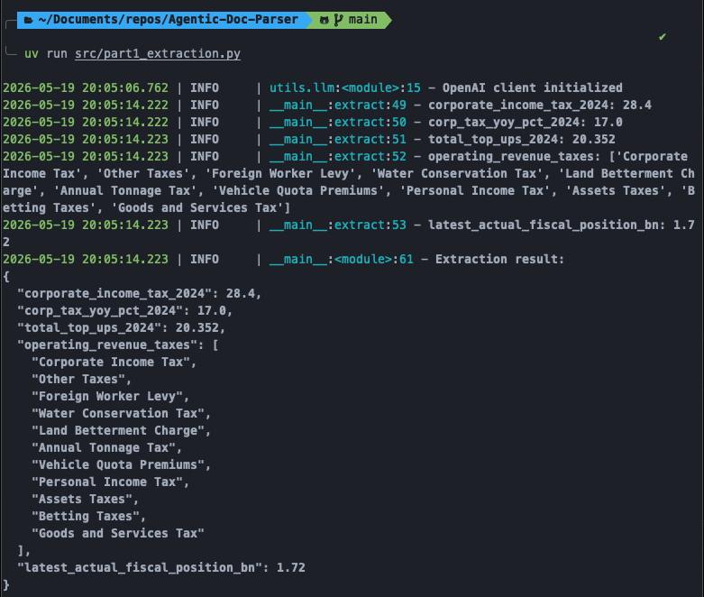

# Part 1 — Structured Extraction

## Overview

Part 1 demonstrates single-shot structured extraction from a PDF using GPT-4o. The pipeline parses specific pages of the Singapore FY2024 budget document with [Docling](https://github.com/DS4SD/docling), feeds the extracted markdown to GPT-4o with a JSON-mode system prompt, and validates the output against a Pydantic schema.

Five fields are extracted in a single LLM call:

| Field | Type | Source Page |
|---|---|---|
| Corporate Income Tax (FY2024) | `float` | Page 5 |
| YOY % change in Corp Income Tax (FY2024) | `float` | Page 5 |
| Total top-ups to Endowment & Trust Funds (FY2024) | `float` | Page 20 |
| Taxes listed in "Operating Revenue" section | `list[str]` | Pages 5–6 |
| Latest Actual Fiscal Position (billions) | `float` | Page 8 |

## Questions (Ground Truth)

The five extraction targets with their source pages:

  
  
  
  
  
  

## Results



All five fields were extracted correctly:

```json
{
  "corporate_income_tax_2024": 28.4,
  "corp_tax_yoy_pct_2024": 17.0,
  "total_top_ups_2024": 20.352,
  "operating_revenue_taxes": [
    "Corporate Income Tax",
    "Other Taxes",
    "Foreign Worker Levy",
    "Water Conservation Tax",
    "Land Betterment Charge",
    "Annual Tonnage Tax",
    "Vehicle Quota Premiums",
    "Personal Income Tax",
    "Assets Taxes",
    "Betting Taxes",
    "Goods and Services Tax"
  ],
  "latest_actual_fiscal_position_bn": 1.72
}
```

## Logs

The full run log is available at [`part1.log`](part1.log) and includes the extracted page context sent to the model, all field values as logged by the application, and the final JSON output — useful for verifying the extraction against the source text.

## Discussion

The single-call approach works well here because all five targets live on a small, known set of pages (5, 6, 8, 20). By pre-selecting only the relevant pages and passing them as context, the model has no ambiguity about where to look. JSON mode combined with Pydantic validation ensures the output is structurally correct and type-safe — any malformed response would raise an error immediately rather than silently propagating bad data downstream.

The `operating_revenue_taxes` list is the most interesting field: it requires the model to read a prose paragraph and infer that certain named taxes constitute a list, rather than reading from a structured table. The model correctly identified all taxes, including the sub-items of "Other Taxes" (Foreign Worker Levy, Water Conservation Tax, Land Betterment Charge, Annual Tonnage Tax) that are mentioned inline in the text.
