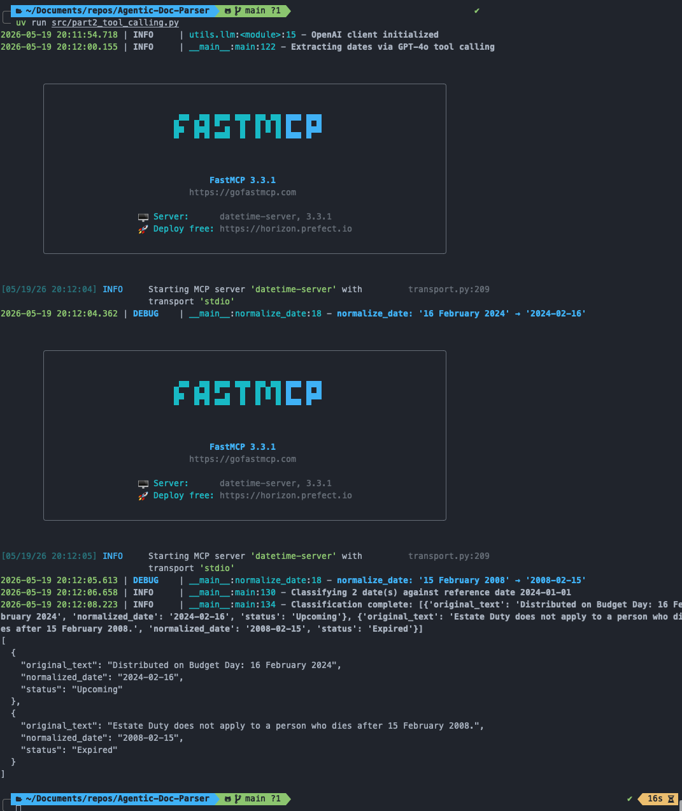

# Part 2 — Tool Calling & Date Normalization

## Overview

Part 2 demonstrates GPT-4o tool calling integrated with a FastMCP server. The pipeline:

1. Parses pages 1 and 36 of the FY2024 budget document
2. Asks GPT-4o to identify dates in the text, calling a `normalize_date` tool (served via FastMCP over stdio) for each one to convert raw date strings to ISO 8601 format
3. Passes the normalized date pairs to a second GPT-4o call that classifies each date as `Upcoming` or `Expired` relative to a reference date of `2024-01-01`

The tool-calling loop runs for up to 5 iterations, handling multiple tool calls per iteration before finalizing extraction.

## Results

Two dates were extracted and processed:

| Original Text | Normalized Date | Classification |
|---|---|---|
| `Distributed on Budget Day: 16 February 2024` | `2024-02-16` | `Upcoming` |
| `Estate Duty does not apply to a person who dies after 15 February 2008.` | `2008-02-15` | `Expired` |

Both dates were correctly normalized to ISO 8601 format and classified correctly against the `2024-01-01` reference date.

## Logs

The full run log is available at [`part2.log`](part2.log) and includes each MCP tool call with its input/output and round-trip timing, the intermediate extracted date pairs, and the final classification result.

## Discussion

The two-stage design (extract-then-classify) keeps each LLM call focused: the first call handles entity recognition and normalization, and the second call handles the classification judgment. This separation makes the pipeline easier to debug and extend — for example, the classification prompt can be changed without touching the extraction logic.

