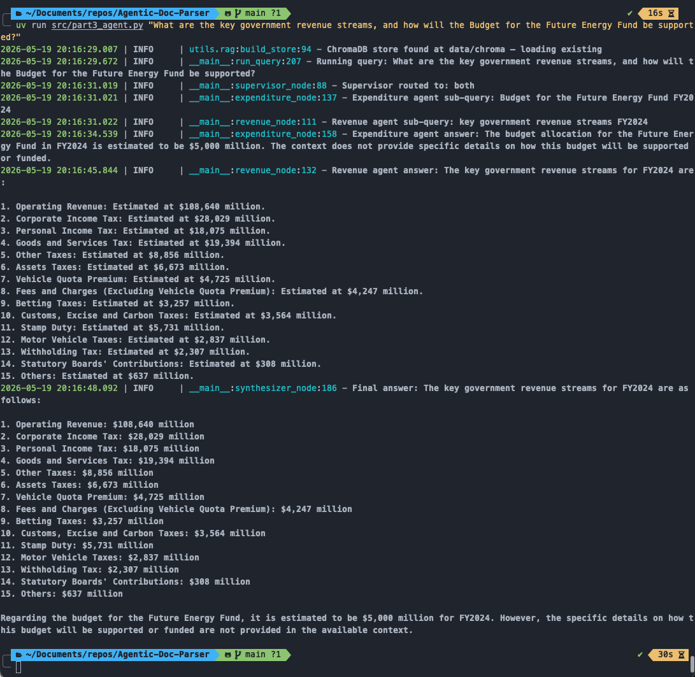
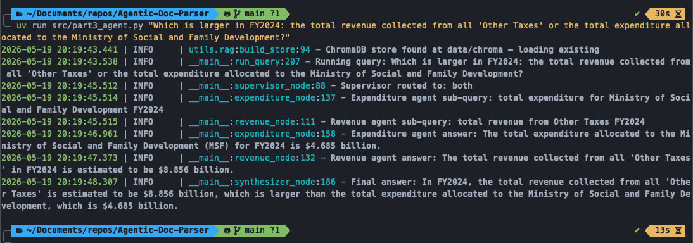
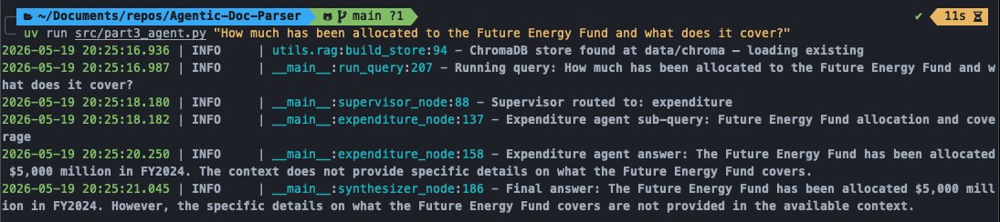
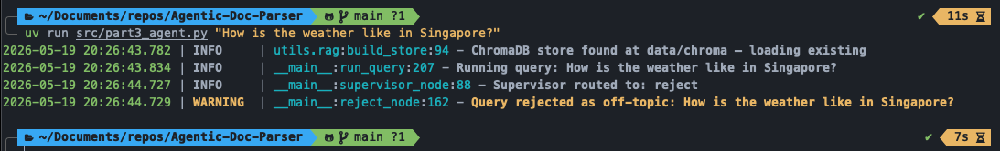

# Part 3 — Multi-Agent RAG with LangGraph

## Overview

Part 3 implements a LangGraph supervisor architecture over a ChromaDB RAG store built from the full FY2024 budget PDF. The system routes each user query to one or both of two domain-scoped agents, then synthesizes their outputs:

```
User Query
    │
    ▼
┌─────────────┐
│  Supervisor │  → routes to: revenue | expenditure | both | reject
└──────┬──────┘
       │
  ┌────┴────┐
  ▼         ▼
Revenue   Expenditure
 Agent      Agent
  │         │
  └────┬────┘
       ▼
  Synthesizer
       │
       ▼
  Final Answer
```

Each agent receives a domain-specific sub-query decomposed by the supervisor, retrieves relevant chunks from ChromaDB (top-k=4), and answers its focused sub-question. The synthesizer merges both outputs into a single coherent response.

## Test Results

Four queries were tested:

---

### Question 1 — Multi-domain (Both Agents)

**Query:** *"What are the key government revenue streams, and how will the Budget for the Future Energy Fund be supported?"*

**Routing:** `both` (revenue + expenditure agents in parallel)



**Outcome:** Correct. The revenue agent retrieved the full revenue breakdown table and listed all 15 revenue streams with FY2024 estimated figures. The expenditure agent retrieved the top-ups table confirming the $5,000M Future Energy Fund allocation. The synthesizer correctly merged both.

---

### Question 2 — Multi-domain (Both Agents)

**Query:** *"Which is larger in FY2024: the total revenue collected from all 'Other Taxes' or the total expenditure allocated to the Ministry of Social and Family Development?"*

**Routing:** `both` (revenue + expenditure agents in parallel)



**Outcome:** Correct. The revenue agent found Other Taxes = $8,856M; the expenditure agent found MSF = $4,685M. The synthesizer correctly concluded Other Taxes is larger.

---

### Question 3 — Single Domain (Expenditure Agent Only)

**Query:** *"How much has been allocated to the Future Energy Fund and what does it cover?"*

**Routing:** `expenditure` only



**Outcome:** Partially correct. The allocation ($5,000M) was retrieved correctly from the top-ups table. However, the agent could not answer what the fund *covers* because the relevant context (description of the Future Energy Fund's scope) was not among the 4 retrieved chunks.

**Root cause:** The retriever uses top-k=4 with a single query. The sub-query "Future Energy Fund allocation and coverage" retrieved the allocation table and generic fund definition text, but missed the specific section of the document that describes the fund's purpose and scope.

**Future improvement:** Increase `top_k` to retrieve more candidate chunks, or update the agent to generate multiple sub-queries (e.g. one for the allocation figure, one for the fund description) and merge the retrieved context before answering.

---

### Question 4 — Off-topic (Rejected)

**Query:** *"How is the weather like in Singapore?"*

**Routing:** `reject`



**Outcome:** Correct. The supervisor correctly identified the query as outside the scope of the FY2024 budget document and returned a rejection response without invoking any agents.

## Logs

Per-query logs are available for each test case:

| Query | Log File |
|---|---|
| Q1 — Revenue streams + Future Energy Fund | [`part3_q_1.log`](part3_q_1.log) |
| Q2 — Other Taxes vs MSF expenditure | [`part3_q_2.log`](part3_q_2.log) |
| Q3 — Future Energy Fund allocation & coverage | [`part3_q_3.log`](part3_q_3.log) |
| Q4 — Weather (off-topic rejection) | [`part3_q_4.log`](part3_q_4.log) |

Each log captures supervisor routing decisions, agent sub-queries, retrieved chunks with their content, individual agent answers, and the final synthesized response.

## Discussion

The supervisor-based routing worked reliably across all four test cases, correctly identifying whether a query spans both revenue and expenditure domains, belongs to a single domain, or is entirely off-topic.

The main limitation exposed by Q3 is retrieval depth. With top-k=4, the system is biased towards chunks that match the query embedding most closely, but it can miss contextual information that sits in a nearby — but not top-ranked — chunk. The allocation table scored high because it contains the fund name explicitly; the prose description of what the fund finances may have been ranked lower due to embedding distance.

A secondary consideration is query decomposition: the supervisor currently generates one sub-query per domain. For compound questions (allocation *and* coverage), generating two queries and merging the retrieved context would improve recall without needing to raise top-k globally.
